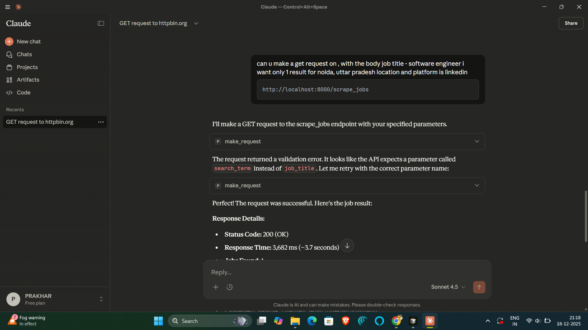

# TalkAPI - Conversational API Testing

**Built by RAJ**

TalkAPI is an MCP (Model Context Protocol) server that revolutionizes API testing by replacing traditional tools like Postman with intelligent, conversational workflows. Instead of manually crafting requests, switching between applications, and managing authentication tokens, TalkAPI enables you to test your APIs through natural language conversations directly within Claude Desktop.

The server intelligently handles complex scenarios like authentication flows, token extraction, request chaining, and response validation—all through simple conversational prompts. Whether you're testing local development APIs, debugging authentication issues, or validating API contracts, TalkAPI transforms the tedious process of API testing into a seamless, conversational experience. The LLM automatically extracts tokens from login responses, adds them to subsequent requests, analyzes error messages to suggest fixes, and validates responses against JSON schemas—all without you having to write a single line of configuration code.



*Example: Making API requests through Claude Desktop with automatic error correction*

## Features

- **`make_request`** - HTTP request handler (GET, POST, PUT, PATCH, DELETE)
- **`decode_jwt`** - JWT token decoder with expiration checking
- **`validate_json_schema`** - JSON schema validator for API responses

The LLM automatically handles token extraction, header management, and response analysis.

## Installation

1. Install dependencies globally:

```bash
pip install -r requirements.txt
```

2. Test the server:

```bash
python server.py
```

The server should start and wait for connections. Press Ctrl+C to stop.

## Setup Claude Desktop

1. Open Claude Desktop config file:
   - **Windows**: `%APPDATA%\Claude\claude_desktop_config.json`
   - **macOS**: `~/Library/Application Support/Claude/claude_desktop_config.json`
   - **Linux**: `~/.config/Claude/claude_desktop_config.json`

2. Add this configuration (replace the path with your project location):

```json
{
  "mcpServers": {
    "talk-api": {
      "command": "python",
      "args": ["C:\\Projects2\\TalkAPI\\server.py"],
      "cwd": "C:\\Projects2\\TalkAPI"
    }
  }
}
```

**Important**: Use absolute paths. On Windows, use double backslashes `\\` or forward slashes `/`.

3. Restart Claude Desktop completely.

4. Verify connection: In Claude Desktop, go to Settings → Developer. You should see "talk-api" listed and connected.

## Making Requests

Simply describe what you want in Claude Desktop chat. The LLM will use the tools automatically.

### Examples

**Simple GET request:**
```
Make a GET request to https://httpbin.org/json
```

**Test local API:**
```
Get all users from http://localhost:8000/api/users
```

**Login flow:**
```
Login to http://localhost:8000/api/login with username 'admin' and password 'secret', then get my dashboard
```

**Decode JWT:**
```
Decode this JWT token: eyJhbGciOiJIUzI1NiIsInR5cCI6IkpXVCJ9...
```

**Validate response:**
```
Check if the response from /api/users matches a schema where each user has an id (integer) and name (string)
```

### Response Format

All responses include:
- `status_code` - HTTP status code
- `response_time_ms` - Response time in milliseconds
- `headers` - Response headers
- `body` - Response body (parsed JSON or text)
- `analysis_hint` - Debugging suggestions for errors

## Troubleshooting

**Server not connecting:**
- Verify Python path: `python --version`
- Check file paths are absolute in config
- Ensure dependencies are installed: `pip install -r requirements.txt`
- Restart Claude Desktop after config changes

**Module not found:**
```bash
pip install -r requirements.txt
```

**Server disconnects:**
- Check Claude Desktop logs (Settings → Developer → Open Logs Folder)
- Verify server starts manually: `python server.py`
- Ensure all imports work: `python -c "import tools; import utils"`

## Project Structure

```
TalkAPI/
├── server.py              # Main MCP server
├── tools/                 # Tool implementations
│   ├── make_request.py
│   ├── decode_jwt.py
│   └── validate_json_schema.py
├── utils.py               # Utility functions
└── requirements.txt       # Dependencies
```

## Author

**RAJ** - Built with ❤️ for the developer community

## License

MIT
